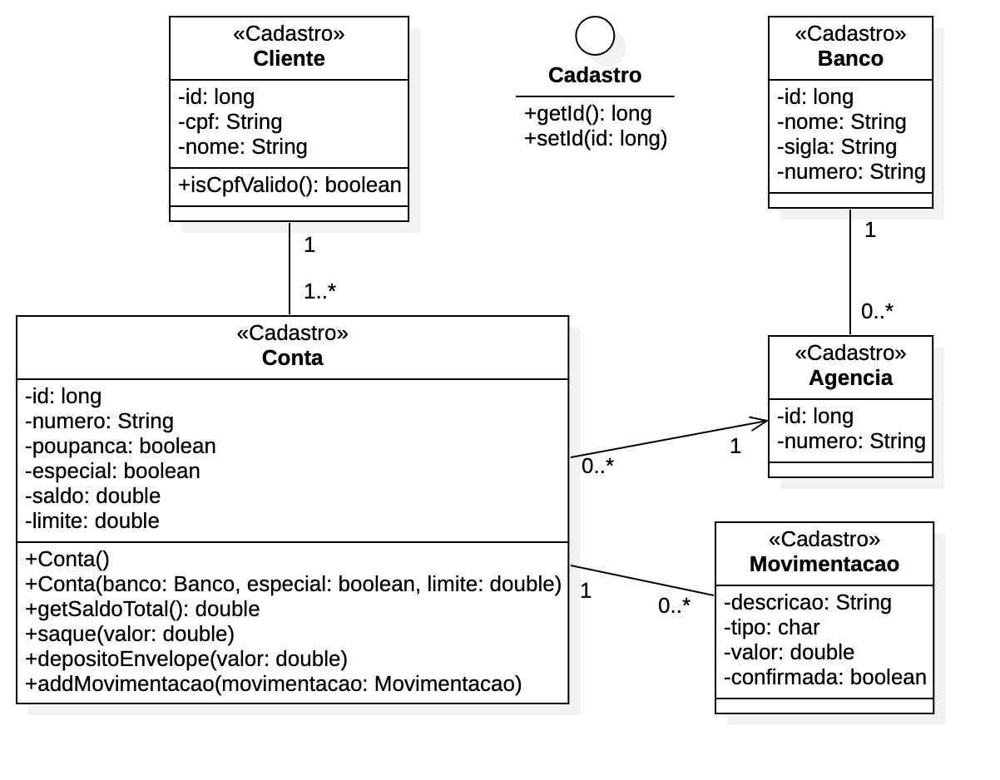

:source-highlighter: highlightjs
:numbered:
:unsafe:
:font: icons

ifdef::env-github[]
:outfilesuffix: .adoc
:caution-caption: :fire:
:important-caption: :exclamation:
:note-caption: :paperclip:
:tip-caption: :bulb:
:warning-caption: :warning:
endif::[]

= Sistema Bancário para Testes com JUnit 5

IMPORTANT: Vídeo: https://youtu.be/isOY-qG5bxU[🧪⚙️☕️ #1 TDD com JUNIT 5 no VS CODE: Implementando Regras de Negócio em JAVA pra um Sistema Bancário]

Este projeto fornece um conjunto de classes base para que sejam implementados testes unitários
a partir de um conjunto de requisitos detalhados na documentação. O diagrama abaixo apresenta as classes existentes. 

.Diagrama das Classes de Negócio do Sistema Bancário (pacote link:src/main/java/com/sistemabancario/model[model]).

{nbsp} + 

O código de tais classes foi gerado a partir do http://staruml.io[StarUML] e está disponível em um link:src[projeto Java
na pasta src], contendo a mesma documentação disponível no projeto UML.
A documentação JavaDoc incluída no código fonte das classes informa como os métodos devem funcionar,
quais as regras de validação de atributos e outros detalhes.
A partir destas definições apresentadas, pode-se então escrever os testes e o código dos métodos gerais, getters e setters das classes. Observe que estes dois últimos tipos de métodos não são mostrados no diagrama por simplificação.

== Apresentações

Alguns conceitos relacionados a testes de software são mostrados nas apresentações abaixo:

- https://docs.google.com/presentation/d/e/2PACX-1vQiRM6mLQ496ptdlXhmILYO__PzXjBHyrzGOPgfCVwWy-0a7h3v-S9bbdHm7V6HO8Y4sQLkvexQvWy3/pub?start=true&loop=false&delayms=60000[Code Coverage]: fundamentos de cobertura de código e como utilizar em projetos Java com http://junit.org[JUnit] e http://jacoco.org/jacoco[JaCoCo]. https://youtu.be/amDFHIg-D_U[Vídeo-aula disponível aqui].
- https://docs.google.com/presentation/d/e/2PACX-1vQwATi-XTUnQcXi1S2Q6p_O37gQ68D7z0hDzQBSnrIc1WVPmJNoR3lmddY47KFLDpk9iAQoizaVdFOR/pub?start=true&loop=false&delayms=60000[Continuous Integration e Continuous Deployment (CI/CD)]: fundamentos de Integração Contínua e Implantação Contínua. https://youtu.be/wA1RbmK-QRA[Vídeo-aula disponível aqui].

[IMPORTANT]
====
O relatório de cobertura de código do JaCoCo **NÃO é gerado** se existir algum espaço em qualquer lugar no caminho completo da pasta onde você salvou o projeto. Por exemplo, se o projeto estiver em: 

`/home/usuario/meus projetos/projeto incrível` 

você deverá renomear as pastas para algo como (preferencialmente evitando acentos) 

`/home/usuario/meus-projetos/projeto-incrivel`.
====
